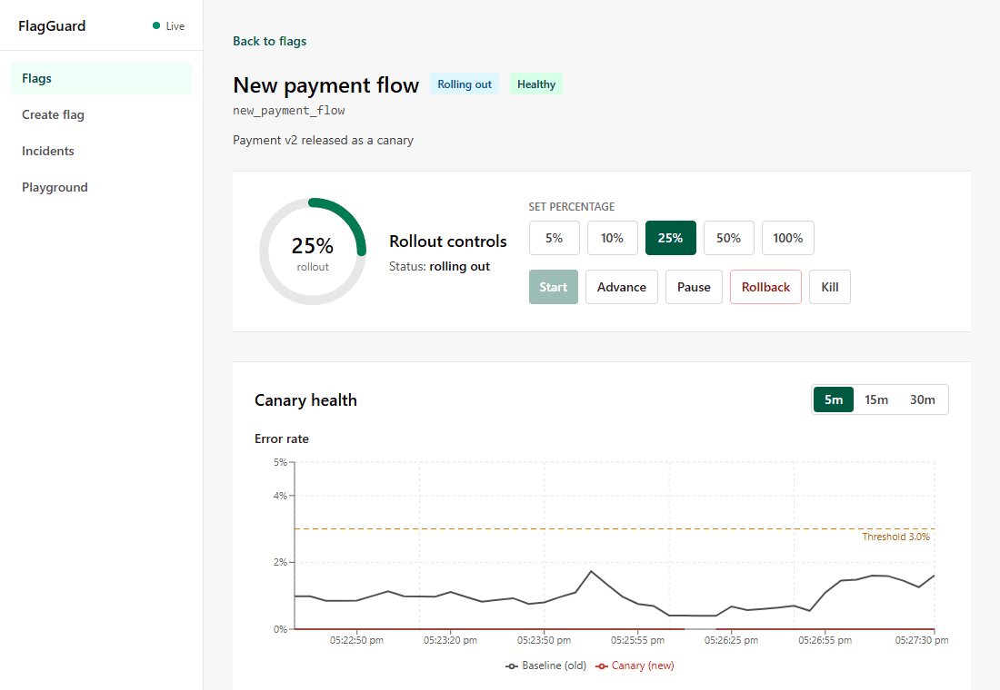
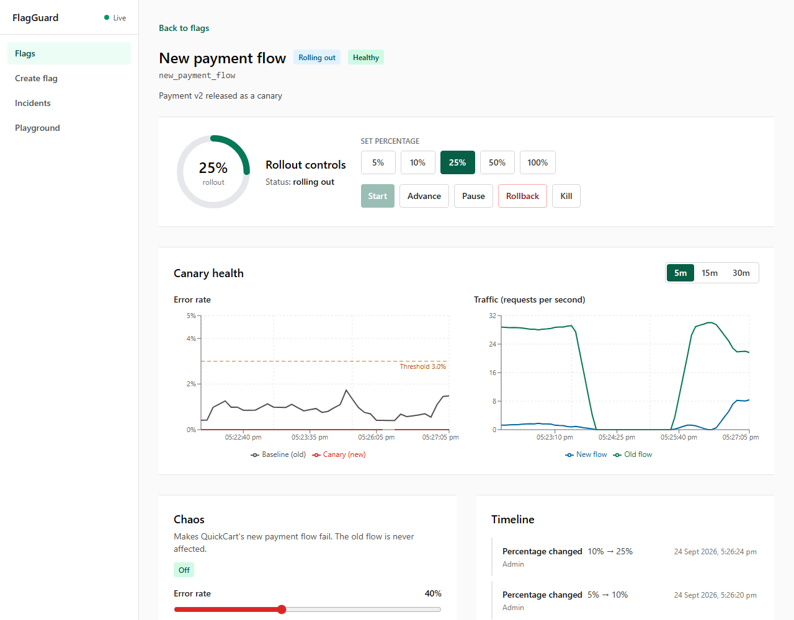
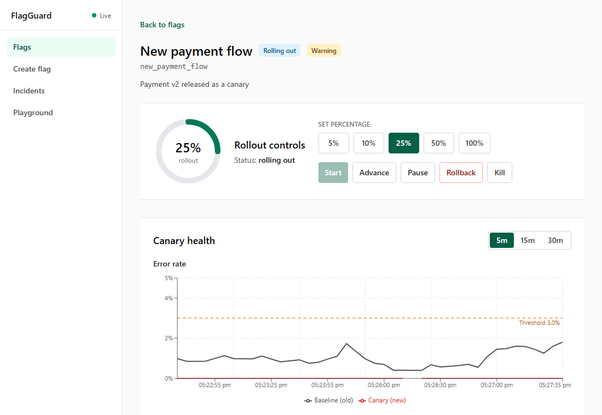
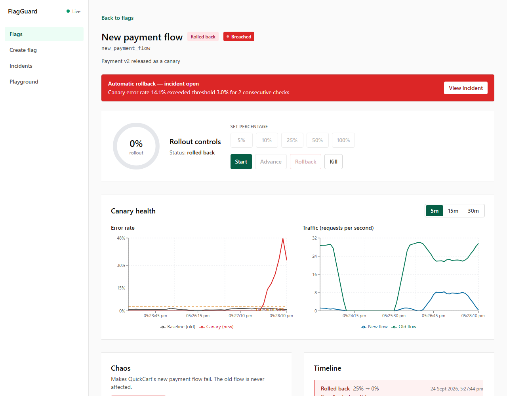
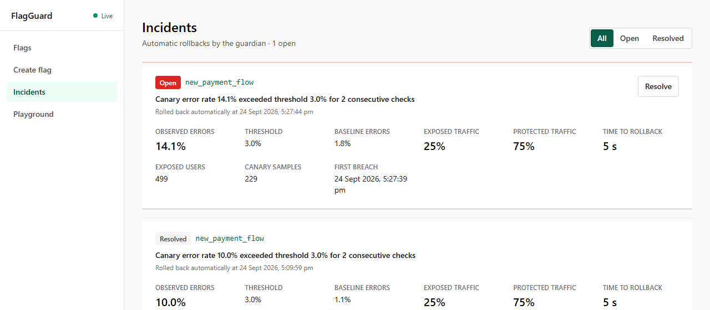

# FlagGuard demo script

A 5-minute live demo, run entirely from the dashboard plus the QuickCart shop.

**One-line pitch:** a bad release reaches only a small, controlled slice of users, and the platform detects it and rolls it back automatically before everyone else is affected.

## What you need

- Docker Desktop, Go 1.22+, Node 20+, and Git Bash (Windows) or any shell.
- Two browser windows side by side:
  - **Dashboard:** http://localhost:5173
  - **QuickCart:** http://localhost:5174

## Setup (about 10 minutes before you present)

Run each app in its own terminal, in this order.

| # | Terminal | Command | Ready when |
|---|---|---|---|
| 1 | repo root | `docker compose up -d` | `docker compose ps` shows postgres, redis and prometheus up |
| 2 | `platform/` | `go run ./cmd/server` | log says `platform listening` |
| 3 | `quickcart/server/` | `npm run dev` | http://localhost:4000/healthz returns `{"status":"ok"}` |
| 4 | `quickcart/web/` | `npm run dev` | http://localhost:5174 shows the menu |
| 5 | `dashboard/` | `npm run dev` | http://localhost:5173 shows **Live** next to FlagGuard |
| 6 | repo root | `./scripts/seed.sh` | prints `new_payment_flow is at 0% and ready for the demo` |
| 7 | `loadgen/` | `go run . -rps 30 -duration 30m` | prints a summary every 5 s with `rps` ≈ 30 |

Start the load generator **at least 1 minute before you present**, so the baseline error-rate line has data. It must keep running for the whole demo: the guardian needs at least 20 canary requests per 30 seconds, and 30 req/s gives it plenty.

Open the dashboard on **Flags → New payment flow** and QuickCart on the menu. Pick **Demo Canary** in QuickCart's *Paying as* menu.

## The demo

| Time | Step | Click exactly | What the audience sees | Say |
|---|---|---|---|---|
| 0:00 | 1. The starting point | Dashboard: **Flags**, then **New payment flow** | Flag at **0%**, status *Rolled back* or *Draft*, health *Not monitored*. The **Error rate** chart shows only the grey baseline line at about 1%. | "Everyone is on the old payment. About 1% of payments fail, which is our normal baseline." |
| 0:30 | 2. Gradual rollout | **Start**, then **10%**, then **25%** | The ring moves 5% → 10% → 25%. A toast confirms each step. The **Timeline** lists each change. Within about 10 seconds the health badge turns green **Healthy**. | "We release to 5%, then 10%, then 25%. Every step is recorded." |
| 1:15 | 3. Real users, two flows | QuickCart: **Add** any dish, **Checkout**, **Pay now** as *Demo Canary*. Then switch *Paying as* to another persona and pay again. | Demo Canary's confirmation shows **New payment · canary** (they are on the include list). Most other personas show **Classic payment**. | "A quarter of users get the new payment; everyone else keeps the old one." |
| 2:15 | 4. Something goes wrong | Dashboard: in **Chaos**, leave error rate at **40%**, click **Start chaos**, then **Start chaos** in the dialog | The Chaos badge turns red with a countdown. | "Now the new payment starts failing, the way a real bug would." |
| 2:25 | 5. Detection | Nothing; watch the top of the page | The health badge turns amber **Warning**, then red **Breached**. The red *Canary (new)* line climbs past the dashed **Threshold 3.0%** line while the grey baseline stays flat. | "The guardian checks Prometheus every 5 seconds. Two breaches in a row and it acts." |
| 2:40 | 6. Automatic rollback | Nothing | Within about 10–30 seconds: a red toast *Guardian rolled back new_payment_flow*, a red **Automatic rollback — incident open** banner, the ring drops to **0%**, and the Timeline shows **Rolled back 25% → 0%** by **Guardian (automatic)**. | "No human touched anything. The platform rolled itself back." |
| 3:10 | 7. Users are safe | QuickCart: pay again as *Demo Canary* | **Classic payment**. | "Even our canary user is back on the stable payment." |
| 3:30 | 8. The incident | Dashboard: **View incident** in the red banner | The incident card: observed error rate vs the 3% threshold, **25% exposed, 75% protected**, exposed users, and **time to rollback** (about 5 s). | "Only 25% of traffic was ever exposed. 75% never saw the bug, and the rollback took seconds." |
| 4:15 | 9. Recover | Back on the flag page: **Stop** in Chaos. On **Incidents**: **Resolve**. On the flag page: **Start** | The flag rolls out to 5% again; QuickCart payments succeed. | "Bucketing is deterministic, so the same first 5% of users get the new flow again." |

Other screenshots: [flags list](images/01-flags-list.png), [QuickCart menu](images/03-quickcart.png), [the whole flag page after a rollback](images/07-flag-page-full.png).

## Reset between rehearsals

1. Dashboard: **Stop** chaos (it also stops by itself after its duration).
2. **Incidents**: **Resolve** any open incident, so the red banner disappears.
3. Repo root: `./scripts/seed.sh`. This rolls `new_payment_flow` back to 0% and restores its default settings.

For a completely clean database, stop the apps and run `docker compose down -v && docker compose up -d`, then start again from setup step 2. This deletes all data, so only a human should run it.

## Troubleshooting

| You see | Cause | Fix |
|---|---|---|
| **Polling** instead of **Live** next to FlagGuard | The dashboard lost its live connection to the platform | Check the platform terminal. The page still refreshes every 5 s and reconnects on its own. |
| Charts say *metrics unavailable* | Prometheus is not reachable | `docker compose ps`; restart with `docker compose up -d` |
| Health stays **Insufficient data** | Fewer than 20 canary requests in 30 s | Make sure the load generator is running at 30 req/s and the rollout is at least 5% |
| No rollback after chaos starts | No traffic reaches the new flow | Check the load generator summary: `new.failed` should be climbing |
| Health shows **Not monitored** a minute after a rollback | Expected: the guardian stops watching a rolled-back flag, and its last record expires after 60 s | Nothing to fix |
| A persona you expected on the new flow gets **Classic payment** | Bucketing depends on each flag's random salt, so a fresh database picks different users | Demo Canary always gets the new flow; use the **Playground** to check any other user |
| **QuickCart unreachable** in the Chaos panel | The QuickCart server is not running on port 4000 | Start it (setup step 3) |
